<div align="center">

<!-- Automatically switches based on GitHub theme -->
<picture>
  <source media="(prefers-color-scheme: dark)" srcset="./profile-dark.svg">
  <source media="(prefers-color-scheme: light)" srcset="./profile-light.svg">
  
</picture>

</div>

---

<div align="center">

### 👋 Welcome to my GitHub Profile!

I'm a passionate developer who loves building amazing things with code. Currently exploring the world of **web development** and **cloud technologies**.

</div>

## 🚀 About Me

- 🔭 I'm currently working on exciting web projects
- 🌱 Learning new technologies every day
- 👯 Looking to collaborate on open source projects
- 💬 Ask me about React, TypeScript, Node.js
- ⚡ Fun fact: I automate everything!

## 📈 GitHub Stats

<div align="center">

<picture>
  <source media="(prefers-color-scheme: dark)" srcset="https://github-readme-stats.vercel.app/api?username=Dineshs737&show_icons=true&theme=github_dark&hide_border=true&bg_color=0d1117&title_color=58a6ff&icon_color=58a6ff&text_color=c9d1d9">
  <source media="(prefers-color-scheme: light)" srcset="https://github-readme-stats.vercel.app/api?username=Dineshs737&show_icons=true&theme=default&hide_border=true&bg_color=ffffff&title_color=0969da&icon_color=0969da&text_color=24292f">
  
</picture>

<picture>
  <source media="(prefers-color-scheme: dark)" srcset="https://github-readme-stats.vercel.app/api/top-langs/?username=Dineshs737&layout=compact&theme=github_dark&hide_border=true&bg_color=0d1117&title_color=58a6ff&text_color=c9d1d9">
  <source media="(prefers-color-scheme: light)" srcset="https://github-readme-stats.vercel.app/api/top-langs/?username=Dineshs737&layout=compact&theme=default&hide_border=true&bg_color=ffffff&title_color=0969da&text_color=24292f">
  
</picture>

</div>

## 🛠️ Tech Stack

```typescript
const skills = {
  languages: ['JavaScript', 'TypeScript', 'Python','Java'],
  frontend: ['React', 'HTML/CSS', 'Tailwind'],
  backend: ['Node.js', 'Express', 'SpringBoot'],
  databases: ['MySQL', 'PostgreSQL', 'MongoDB'],
  tools: ['Git', 'Docker', 'Neovim', 'VS Code'],
  learning: ['Kubernetes', 'GraphQL', 'Rust']
};
```

## 🎨 Theme Support

This profile automatically adapts to your GitHub theme:
- 🌙 **Dark Mode** - Perfect for night coding sessions
- ☀️ **Light Mode** - Clean and bright for daytime

Switch your GitHub appearance settings to see it change!

## 📫 Connect With Me

<div align="center">

[](https://github.com/Dineshs737)
[](https://linkedin.com/in/yourprofile)
[](https://twitter.com/yourhandle)

</div>

---

<div align="center">

**Last Updated:** October 30, 2025

*This README is automatically updated using GitHub Actions* ⚡

</div>